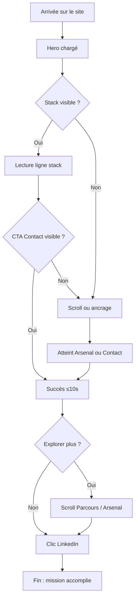

# UX Design Specification my-portfolio

**Author:** Florian
**Date:** 2026-02-01

---

## Executive Summary

### Project Vision

**my-portfolio** est un portfolio web personnel qui transcende le CV numérique traditionnel pour offrir une **expérience narrative et visuelle immersive**. Le site raconte le parcours d'un développeur full-stack senior (9+ ans) à travers 3 chapitres géographiques (Départ France, Expansion Angleterre, Aujourd'hui), tout en permettant aux recruteurs de trouver rapidement la stack technique et un moyen de contact.

L'objectif est double : transmettre personnalité, créativité et parcours (voyage, curiosité, ton geek sobre) tout en répondant aux besoins pragmatiques des recruteurs (stack visible en ≤ 10 secondes, contact immédiat).

### Target Users

**Utilisateurs Principaux**

- **Florian (propriétaire)** — Le site doit représenter fidèlement son identité (pro + créative + dynamique) et lui procurer du plaisir. C'est un outil de représentation personnelle autant qu'un outil professionnel.

- **Recruteurs** — Tech-savvy modérés, consultent principalement sur desktop (bureau, recherche de candidats, préparation entretien). Ils ont 2 minutes pour évaluer : Stack ? Senior ? Fit ? Contact ?
  - **Frustration actuelle** : LinkedIn/CV trop textuels, pas de hiérarchie visuelle des compétences, impossible de voir les **relations entre langages et frameworks** (ex : React ↔ TypeScript)
  - **Besoin** : Trouver stack + contact rapidement MAIS aussi comprendre parcours et personnalité si temps disponible

**Utilisateurs Secondaires**

- **Clients potentiels freelance** — Évaluent fiabilité, style, compétences avant de contacter
- **Autres devs** — Découvrent le parcours, s'inspirent, ou cherchent à collaborer

**Contexte d'utilisation** : Bureau (desktop), recherche de candidats ou préparation entretien. Parfois mobile (LinkedIn en déplacement) mais minoritaire.

### Key Design Challenges

1. **Visualiser les relations entre technologies**
   - LinkedIn = liste plate sans hiérarchie ni liens visuels entre langages et frameworks
   - **Challenge UX** : Comment montrer clairement qu'un framework est lié à un langage (React ↔ TypeScript, Node ↔ JavaScript) ?
   - **Approche** : Groupement visuel dans l'Arsenal, code couleur, hiérarchie graphique, ou clustering par "famille"

2. **Double objectif : rapidité + exploration**
   - Recruteurs veulent la stack en ≤ 10 secondes (scan rapide)
   - Mais ils veulent aussi explorer parcours et personnalité (temps passé plus long)
   - **Challenge UX** : Permettre le scan ultra-rapide (hero + stack visible immédiatement) SANS sacrifier l'expérience narrative plus riche pour ceux qui veulent explorer

3. **Performance et motion au scroll**
   - Desktop-first, mais contrainte des 10 secondes reste critique
   - Motion sobre au scroll (style Apple) pour renforcer la narrative sans bloquer l'accès à l'info
   - **Challenge UX** : Animations qui enrichissent l'expérience SANS impacter lisibilité immédiate ni performance

### Design Opportunities

1. **Arsenal visuel structuré (impossible sur LinkedIn/CV)**
   - Grouper les technos par "famille" (Frontend/Backend/DevOps) avec relations visibles entre langages et frameworks
   - Utiliser hiérarchie graphique pour montrer expertise (années, niveau, profondeur)
   - **MVP** : Vue statique structurée, claire, scannable rapidement
   - **Post-MVP** : Vue interactive/graphique (graph de relations, carte mentale, constellation) avec toggle pour explorer les liens entre technos
   - **Impact** : Différenciation forte vs LinkedIn/CV texte, facilite compréhension des compétences techniques

2. **Navigation "edge case recovery"**
   - Ancrages/sticky navigation pour recruteurs pressés qui "ratent" la stack au premier scroll
   - Boutons "Arsenal", "Parcours", "Contact" toujours accessibles
   - **Impact** : Même les visiteurs stressés/rapides trouvent ce qu'ils cherchent (résilience UX)

3. **Narrative géographique immersive**
   - 3 chapitres (France, Angleterre, Aujourd'hui) avec visuels/icônes de lieux
   - Compétences attachées à chaque étape du parcours
   - Motion sobre au scroll pour renforcer le voyage sans bloquer
   - **Impact** : Mémorable, différenciant, montre personnalité + évolution en un coup d'œil

4. **Exploration progressive (vision long terme)**
   - MVP : expérience linéaire claire (Hero → Parcours → Arsenal → Contact)
   - Post-MVP : Carte projets (planisphère style jeu), 404 GeoGuessr (easter egg), double vue Arsenal (statique/interactive)
   - **Impact** : Engagement long terme, mémorabilité, plaisir personnel

---

## Core User Experience

### Defining Experience

Le cœur de l'expérience **my-portfolio** repose sur une **double voie d'accès** qui répond simultanément à deux besoins utilisateurs distincts :

**Voie rapide (critique)** : Les visiteurs pressés (recruteurs avec 2 minutes) doivent trouver la **stack technique en ≤ 10 secondes** et un **moyen de contact immédiat**. C'est l'objectif non-négociable qui conditionne toute la hiérarchie visuelle.

**Voie exploratoire (enrichissante)** : Les visiteurs qui ont du temps peuvent explorer le **parcours géographique** (3 chapitres), l'**Arsenal structuré** avec relations entre technos, et la **personnalité** (voyage, créativité, ton geek sobre). Cette voie crée la mémorabilité et la différenciation.

L'expérience est conçue pour que ces deux voies coexistent sans friction : le scan rapide ne bloque pas l'exploration, et l'exploration n'empêche pas le scan rapide.

### Platform Strategy

**Plateforme principale : Desktop**
- Contexte d'utilisation : bureau, recherche de candidats, préparation entretien
- Interaction : souris/clavier avec enrichissements visuels (hover states, mouse movement, scroll parallax)
- Motion sobre qui guide l'œil naturellement vers les éléments clés

**Plateforme secondaire : Mobile**
- Doit fonctionner correctement et proprement
- Motion adapté mais pas de gestures complexes requises
- Focus sur la lisibilité et l'accès rapide à la stack et au contact

**Hors scope** : Fonctionnalité offline (pas de besoin identifié pour un portfolio)

### Effortless Interactions

Les interactions suivantes doivent être **instantanées et sans effort mental** :

1. **Trouver la stack** — Visible immédiatement au chargement de la page, focus automatique sur la ligne stack dans le Hero
2. **Naviguer entre sections** — Ancrages clairs (Arsenal, Parcours, Contact) accessibles via menu ou sticky navigation, pas de scroll infini aveugle
3. **Comprendre où on est** — Repères visuels clairs pour chaque section, pas de perte d'orientation
4. **Accéder au contact** — CTA Contact (LinkedIn) visible en ≤ 10s, toujours accessible

**Problèmes résolus vs portfolios classiques** :
- Scroll infini sans repères → Navigation avec ancrages et repères visuels clairs
- Stack noyée dans le texte → Stack visible immédiatement, focus automatique
- Menus cachés ou navigation obscure → Navigation transparente, toujours accessible

**Wow moment : Motion sobre qui guide l'œil** — Les animations au scroll (parallax, transitions) dirigent naturellement le regard vers les éléments clés sans jamais bloquer l'accès à l'information.

### Critical Success Moments

**Moment "ce portfolio est meilleur"** :
- Quand le visiteur trouve la **stack immédiatement** au chargement
- Quand il découvre l'**Arsenal structuré** avec relations visuelles entre langages et frameworks (impossible sur LinkedIn/CV)
- Combinaison = différenciation instantanée

**Moment de satisfaction utilisateur** :
- Quand le visiteur a **compris le parcours** (3 chapitres géographiques + compétences par étape)
- Signal "j'en ai appris plus sur lui" atteint

**Moments d'échec à éviter absolument** :
- Ne pas trouver la stack en ≤ 10 secondes → Perte immédiate du visiteur pressé
- Ne pas comprendre comment naviguer → Frustration et abandon
- Motion qui bloque ou ralentit l'accès à l'information → Ruine l'expérience

**Succès première visite** :
- Le visiteur voit **quelque chose qui le marque** : parcours géographique unique, Arsenal visuel structuré, personnalité voyage/geek sobre, motion qui guide l'œil
- Mémorabilité = différenciation vs masse de portfolios génériques

### Experience Principles

Les principes suivants guident toutes les décisions UX pour **my-portfolio** :

1. **"Stack-first, explore-next"**
   - La stack doit être trouvable en ≤ 10 secondes (non-négociable)
   - L'exploration du parcours et de la personnalité reste fluide pour ceux qui veulent approfondir
   - Les deux voies coexistent sans friction

2. **"Motion qui guide, pas qui bloque"**
   - Le motion sobre guide l'œil naturellement vers les éléments clés
   - Jamais de motion qui ralentit l'accès à l'information
   - Desktop : scroll parallax + hover states enrichissent ; Mobile : motion fonctionnel

3. **"Navigation transparente avec repères clairs"**
   - Pas de scroll infini aveugle : l'utilisateur sait toujours où il est
   - Ancrages/sticky navigation pour "edge case recovery"
   - Sections clairement délimitées avec repères visuels

4. **"Arsenal structuré = différenciation immédiate"**
   - L'Arsenal avec relations visuelles entre langages et frameworks est le moment "ce portfolio est meilleur"
   - Impossible à reproduire sur LinkedIn/CV texte
   - MVP : vue statique scannable ; Post-MVP : vue interactive/graphique

5. **"Quelque chose qui marque"**
   - Chaque visite doit laisser une impression mémorable
   - Parcours géographique, motion sobre, personnalité voyage/geek, Arsenal visuel
   - Différenciation vs portfolios génériques

---

## Desired Emotional Response

### Primary Emotional Goals

L'expérience émotionnelle de **my-portfolio** repose sur un équilibre entre **originalité créative** et **confiance professionnelle** :

**Émotion principale : Impressionné + Rassuré + Curieux**
- **Impressionné** par l'originalité (motion sobre, Arsenal visuel structuré, photos voyage, parcours géographique)
- **Rassuré** par la clarté immédiate (stack visible, navigation transparente, propreté sobre)
- **Curieux** d'explorer davantage (parcours en chapitres, personnalité voyage/geek, easter eggs post-MVP)

**Différenciation émotionnelle : Étonnement par originalité MAIS propre**
- Les visiteurs doivent ressentir "ce portfolio est différent" tout en pensant "c'est pro et fiable"
- Équilibre entre créativité (motion, visuels) et professionnalisme (structure, clarté, sobriété)

**Émotions post-mission : Convaincus + Confiants**
- Après avoir trouvé stack + contact : convaincus de l'expertise, confiants dans le fit, prêts à initier contact

### Emotional Journey Mapping

**1. Première découverte (Landing sur Hero)**
- **Émotion désirée** : Rassurés par la clarté
- **Déclencheurs** : Stack visible immédiatement, structure claire, propreté visuelle sobre
- **Éviter** : Confusion, surcharge visuelle, motion qui bloque l'accès à l'info

**2. Pendant l'exploration (Scroll/Navigation dans Parcours et Arsenal)**
- **Émotions désirées** : Émerveillés par le motion + Confortables dans la navigation
- **Déclencheurs** : Motion sobre qui guide l'œil, transitions fluides entre sections, repères visuels clairs, Arsenal structuré unique
- **Éviter** : Perte d'orientation, scroll infini aveugle, motion qui ralentit ou bloque

**3. Après avoir trouvé stack + contact (Mission accomplie)**
- **Émotions désirées** : Convaincus de l'expertise + Prêts à contacter
- **Déclencheurs** : Arsenal avec années d'expérience, clarté des compétences, CTA contact accessible et friendly
- **Éviter** : Doute sur le niveau, difficulté à contacter, intimidation

**4. Si quelque chose rate (Edge case : ne trouve pas stack immédiatement)**
- **Émotion acceptable** : Frustrés MAIS récupérables
- **Déclencheurs de récupération** : Navigation sticky/ancrages visibles, boutons "Arsenal" / "Contact" toujours accessibles
- **Éviter** : Frustration irrémédiable qui mène à l'abandon

**5. Quand ils reviennent (Deuxième visite avant entretien)**
- **Émotion désirée** : Confirmés dans leur choix
- **Déclencheurs** : Mémorabilité (parcours géographique, Arsenal visuel, personnalité), information facile à retrouver
- **Éviter** : Oubli ou impression "c'était quoi déjà ?"

### Micro-Emotions

**Critique (make-or-break) :**

1. **Confiance vs Scepticisme**
   - **Objectif** : Inspirer confiance immédiate (senior, compétent, fiable)
   - **Leviers UX** : Arsenal structuré avec années d'expérience, propreté visuelle sobre, clarté de l'information
   - **Impact** : Sans confiance, pas de contact initié

2. **Accomplissement vs Frustration**
   - **Objectif** : Sentiment d'avoir réussi à trouver ce qu'ils cherchent
   - **Leviers UX** : Indicateurs de progression (repères de sections, scroll indicators), confirmation visuelle quand ils atteignent sections clés (Arsenal, Contact), structure claire montrant qu'ils ont "tout vu"
   - **Impact** : Accomplissement = satisfaction et mémorabilité positive

3. **Délice (Delight) vs Satisfaction simple**
   - **Objectif** : Moments de "wow" qui marquent et différencient
   - **Leviers UX** : Motion sobre au scroll (parallax, transitions), Arsenal visuel unique (impossible sur LinkedIn/CV), photos voyage intégrées, transitions entre chapitres géographiques
   - **Impact** : Délice = mémorabilité et bouche-à-oreille ("j'ai vu un portfolio qui m'a marqué")

**Important (renforce l'expérience) :**

4. **Excitation vs Anxiété**
   - **Objectif** : Excités de te contacter, pas intimidés ou anxieux
   - **Leviers UX** : Ton friendly du CTA ("On gravit la suite ensemble ?"), design accessible et ouvert, lien LinkedIn clair (pas d'email intimidant)
   - **Impact** : Facilite le passage à l'action (contact)

**Secondaire (nice-to-have) :**

5. **Appartenance vs Isolation**
   - **Objectif** : Se sentir connecté au parcours et à la personnalité
   - **Leviers UX** : Narrative géographique immersive, photos voyage, ton geek sobre
   - **Impact** : Renforce l'engagement et l'exploration (post-MVP surtout)

### Design Implications

**Pour créer la CONFIANCE :**
- Arsenal structuré avec **années d'expérience visible** par techno/domaine
- **Propreté visuelle sobre** : palette douce et chaude, typographie claire, espaces blancs généreux
- **Clarté de l'information** : hiérarchie visuelle forte, pas de jargon inutile, structure Frontend/Backend/DevOps limpide

**Pour créer l'ACCOMPLISSEMENT :**
- **Indicateurs de progression** : repères visuels des sections (dots de scroll, menu actif qui s'illumine)
- **Confirmation visuelle subtile** : quand ils atteignent sections clés (Arsenal, Contact), un signal visuel "vous y êtes"
- **Structure claire** : nombre de sections visible, position actuelle évidente, pas de confusion sur "où suis-je ?"
- **"Mission accomplie"** : Stack trouvée ✓, Contact trouvé ✓ → sentiment de succès renforcé visuellement

**Pour créer le DÉLICE (delight) :**
- **Motion sobre au scroll** : parallax, transitions fluides entre sections, animations qui guident l'œil naturellement
- **Arsenal visuel unique** : relations visuelles entre langages et frameworks (code couleur, groupement graphique, hiérarchie)
- **Photos voyage intégrées** : Hero, arrière-plans de chapitres, easter eggs (404 GeoGuessr post-MVP)
- **Transitions entre chapitres** : changement visuel marqué (France → Angleterre → Aujourd'hui) avec icônes/visuels de lieux

**Pour créer l'EXCITATION (sans anxiété) :**
- **Design accessible** : CTA contact friendly, pas intimidant, lien LinkedIn clair et rassurant
- **Ton conversationnel** : "On gravit la suite ensemble ?" plutôt qu'un "Contactez-moi" formel
- **Pas de barrière** : pas de formulaire complexe en MVP, juste un lien externe maîtrisé

### Emotional Design Principles

Les principes émotionnels suivants guident le design de **my-portfolio** :

1. **"Original MAIS rassurant"**
   - Chaque élément créatif (motion, Arsenal visuel, photos) doit être balancé par un élément de confiance (clarté, structure, sobriété)
   - Jamais de créativité au détriment de la confiance professionnelle

2. **"Émerveiller sans bloquer"**
   - Les moments de délice (motion, visuels) ne doivent jamais ralentir ou empêcher l'accès à l'information critique (stack, contact)
   - Priorité absolue : trouver la stack en ≤ 10s, même avec motion activé

3. **"Accomplissement guidé"**
   - L'utilisateur doit toujours savoir où il est, où il peut aller, et ce qu'il a accompli
   - Repères visuels, indicateurs de progression, confirmations subtiles

4. **"Confiance par la structure"**
   - La confiance naît de la clarté et de l'organisation : Arsenal structuré, hiérarchie visuelle forte, information dense mais lisible
   - Années d'expérience et profondeur technique visibles immédiatement

5. **"Contact sans friction"**
   - Le passage à l'action (contacter) doit être excitant, pas anxiogène
   - Ton friendly, design accessible, lien externe maîtrisé (LinkedIn)

---

## UX Pattern Analysis & Inspiration

### Inspiring Products Analysis

**Sources identifiées**

- **Recruteurs tech-savvy** : Malt, Indeed, LinkedIn, Welovedevs
- **Devs** : GitHub, X, dev.to
- **Freelance** : LinkedIn
- **Sites inspirants** : Apple, [Kent C. Dodds](https://kentcdodds.com/), [Brian Cohen](https://bricohen.com/)
- **Data viz** : [Musicmap.info](https://musicmap.info/)

**Kent C. Dodds (kentcdodds.com)** — Message clair dès le Hero ("Helping people make the world better through quality software"), navigation simple (Blog, Courses, Discord, About), ton pro + personnalité (extreme sports, Kody the Koala), sections bien délimitées, CTA explicites, contact visible (Email, Call, Office hours).

**Musicmap.info** — Carte interactive (Carta) : zoom / drag pour naviguer ; **progressive disclosure** : au clic sur un genre → panneau avec description, année, playlist ; **hover** : sur un genre → mise en avant des relations (influences, dérivés) ; super-genres en cadre (couleurs, regroupements) ; légende et repères temporels (décennies) pour ne pas se perdre.

**Apple** — Motion au scroll (parallax, apparitions progressives), hover et micro-interactions soignés, hiérarchie visuelle très claire, typo et espacements, pas de surcharge : une idée forte par bloc.

**Brian Cohen (bricohen.com)** — Ton dev assumé ("SELECT * FROM Brian"), site minimal, identité forte en peu d'éléments.

**Insight utilisateur (Florian)** : *« Une bonne expérience en data viz = plus d'infos au clic ou au zoom ; et au niveau de l'expérience, les effets au déplacement de la souris et au scroll. »*

### Transferable UX Patterns

**Navigation & structure**
- **Menu court et lisible** (type Kent C. Dodds) : Parcours, Arsenal, Contact (+ Blog/courses si besoin plus tard)
- **Ancrages clairs** pour le "edge case recovery" (comme sur Kent : on sait où on va)

**Data viz / Arsenal (MVP + post-MVP)**
- **Progressive disclosure** (inspiration Musicmap) : vue statique en MVP ; en post-MVP, **clic ou zoom = plus d'infos** (détail techno, années, liens langage↔framework)
- **Hover pour les relations** (inspiration Musicmap) : au survol d'une techno, mettre en évidence les liens (ex. React ↔ TypeScript)
- **Cadre visuel** (super-genres = familles) : Frontend / Backend / DevOps avec code couleur ou regroupement graphique

**Motion & ressenti**
- **Effets souris** (Apple + insight utilisateur) : hover sur cartes, boutons, technos ; léger mouvement ou focus pour renforcer la clarté
- **Effets scroll** (Apple + insight utilisateur) : parallax sobre, apparition des sections (Parcours, Arsenal), motion qui guide l'œil sans bloquer l'accès à la stack

**Identité & confiance**
- **Hero clair** (Kent + Apple) : une phrase d'accroche + stack visible + CTA contact
- **Personnalité lisible** (Kent, Brian Cohen) : voyage, geek, créativité sans noyer l'info pro

### Anti-Patterns to Avoid

- **Surcharge au premier écran** : trop d'animations ou de blocs qui cachent la stack et le contact (contre-objectif ≤ 10s)
- **Data viz sans progressive disclosure** : tout afficher d'un coup (comme une liste plate) sans clic/zoom pour le détail (perte du bénéfice "plus d'infos quand on clique/zoome")
- **Scroll sans repères** : pas d'ancrages ni d'indication de section (risque de "scroll infini aveugle")
- **Motion qui bloque** : animations lourdes ou qui retardent l'affichage de la stack/contact
- **Look "template"** : éviter le portfolio générique ; garder une touche personnelle (photos voyage, Arsenal visuel, ton)

### Design Inspiration Strategy

**À adopter**
- **Progressive disclosure** (Musicmap) : vue statique MVP ; post-MVP, **clic/zoom = plus d'infos** sur chaque techno et relations
- **Hover pour révéler les relations** (Musicmap) : survol d'une techno → liens langage/framework mis en évidence
- **Motion souris + scroll** (Apple + insight utilisateur) : hover discret sur éléments clés ; scroll avec parallax/transitions sobres qui guident l'œil
- **Hero + navigation clairs** (Kent C. Dodds) : stack + CTA visibles immédiatement, menu court (Parcours, Arsenal, Contact)

**À adapter**
- **Carta Musicmap** : pour l'Arsenal post-MVP, pas une carte temps mais une **carte de relations** (technos, familles, liens) avec zoom et pan, et détail au clic
- **Densité Kent C. Dodds** : garder sections bien séparées et lisibles, mais avec moins de blocs que lui pour rester focalisé stack + parcours + contact

**À éviter**
- **Carte trop dense d'entrée** : ne pas afficher tout l'Arsenal en mode "Carta" dès le premier écran ; garder une vue statique scannable en MVP
- **Motion prioritaire sur l'info** : les effets souris/scroll ne doivent jamais retarder ou masquer la stack et le contact

---

## Design System Foundation

### Design System Choice

**Shadcn UI** (composants Radix UI) + **Tailwind CSS** — design system thématisable, composants accessibles et personnalisables, intégré à la stack Vite + React + Tailwind du PRD.

### Rationale for Selection

- **Alignement stack** : Tailwind déjà prévu dans le PRD ; Shadcn s'intègre sans changer de stack.
- **Thématisation** : Variables CSS + thème Tailwind pour palette douce et chaude, typographie, espacements, radius.
- **Personnalisation** : Composants copiés dans le projet, modifiables (hover, motion, Arsenal, Hero) sans dépendance opaque.
- **Accessibilité** : Radix UI sous le capot (focus, clavier, aria) pour atteindre le niveau "bon" défini dans le PRD.
- **Poids et contrôle** : Pas de bundle lourd ; seuls les composants utilisés sont ajoutés.
- **Motion et hover** : Tailwind pour transitions/animations ; CSS custom possible pour parallax et effets scroll.

### Implementation Approach

- **Tailwind** : configuration du thème (couleurs, typo, espacements) en cohérence avec la spec UX (palette douce et chaude, motion sobre).
- **Shadcn** : ajout des composants au fil du besoin (Button, Card, Navigation, etc.) via `npx shadcn@latest add <component>`.
- **Composants custom** : Hero, Parcours (chapitres), Arsenal (vue statique puis interactive post-MVP), CTA Contact — basés sur les primitives Shadcn/Radix quand pertinent, sinon composants dédiés stylés en Tailwind.
- **Design tokens** : définir en amont (couleurs primaires/secondaires, familles de polices, espacements, radius) pour cohérence et maintenance.

### Customization Strategy

- **Palette** : définir les tokens couleur (primaire, secondaire, fond, texte) dans `tailwind.config` et/ou variables CSS pour refléter "palette douce et chaude".
- **Typographie** : une ou deux familles lisibles (ex. sans-serif pour le corps, éventuellement une pour les titres) ; tailles et line-heights cohérents.
- **Composants spécifiques** : Arsenal (tags, groupements, relations visuelles), cartes Parcours, CTA Contact — sur base Shadcn si utile, sinon composants sur mesure en Tailwind.
- **Motion** : utilitaires Tailwind (transition, duration) + keyframes si besoin ; éviter les libs lourdes pour rester "motion sobre".

---

## Defining Core Experience

### Defining Experience

**Phrase centrale (expérience définissante) :**

*« Trouve ma stack et comment me contacter en quelques secondes, puis explore mon parcours si tu veux en savoir plus. »*

C’est l’interaction cœur que le produit doit réussir en priorité : scan rapide (stack + contact) puis exploration optionnelle (parcours, Arsenal, personnalité) sans friction.

### User Mental Model

- **Problème actuel** : LinkedIn/CV = liste plate, stack et relations entre technos peu lisibles, contact pas toujours évident.
- **Attente** : Sur un portfolio, le visiteur s’attend à voir rapidement qui tu es, ce que tu fais (stack), et comment te contacter ; puis à pouvoir explorer si le temps le permet.
- **Risque de confusion** : Scroll infini sans repères, stack noyée dans le texte, navigation peu claire → on évite via Hero clair, ancrages, repères visuels.

### Success Criteria

**Ordre de succès (ce qui fait dire "ça marche") :**

1. **Trouver la stack** — Visible en ≤ 10 secondes (dans le Hero ou immédiatement en haut de page).
2. **Trouver le contact** — CTA LinkedIn (et autres réseaux) visible en ≤ 10 secondes, toujours accessible.
3. **Explorer le parcours** — Si le visiteur veut aller plus loin : 3 chapitres géographiques + Arsenal structuré, sans bloquer l’accès à l’info critique.

**Indicateurs de succès** : Stack trouvée → Contact trouvé → Parcours exploré (optionnel). Chaque étape doit être évidente et donner un sentiment d’accomplissement.

### Novel UX Patterns

**Stratégie : D’abord établi, puis nouveau si envie d’aller plus loin.**

- **MVP (établi)** : Pattern portfolio classique — Hero → scroll → sections (Parcours, Arsenal, Contact), navigation par ancrages, stack et CTA visibles immédiatement. Pas d’innovation risquée ; on rend l’existant très clair et rapide.
- **Post-MVP (nouveau)** : Si envie d’aller plus loin — Arsenal en vue interactive/graphique (type Musicmap), progressive disclosure (clic/zoom = plus d’infos), toggle vue statique / vue graphique. Le nouveau pattern sert à ceux qui veulent explorer les relations entre technos sans être imposé à tout le monde.

**Innovation dans le familier** : Motion sobre (parallax, hover), Arsenal visuel structuré (relations langage↔framework) restent dans le cadre d’un portfolio lisible ; la vraie nouveauté (carte interactive) est optionnelle et post-MVP.

### Experience Mechanics

**1. Initiation**  
- Le visiteur arrive (desktop ou mobile).  
- Déclencheur : chargement de la page ; la stack et le CTA contact doivent être visibles sans action (ou avec un scroll minimal).

**2. Interaction**  
- **Voie rapide** : Lecture du Hero (ligne stack + CTA) → clic sur Contact si objectif atteint.  
- **Voie exploratoire** : Scroll ou clic sur les ancrages (Parcours, Arsenal, Contact) → lecture des chapitres et de l’Arsenal.  
- Contrôles : scroll, menu/ancrages, clics sur CTA et liens.

**3. Feedback**  
- Stack visible = pas de doute "où est la stack ?".  
- Repères visuels (sections, menu actif) = "je sais où je suis".  
- Atteindre Arsenal ou Contact = confirmation visuelle subtile (section en vue, CTA accessible).

**4. Completion**  
- **Succès minimal** : Stack trouvée + contact trouvé (≤ 10s).  
- **Succès étendu** : Parcours parcouru, Arsenal vu, sentiment "j’en ai appris plus sur lui".  
- **Suite** : Clic sur CTA LinkedIn (ou autre) pour initier le contact.

---

## Visual Design Foundation

### Color System

**Thème retenu : Option B — Doux & chaud (légèrement coloré)**

- **Fond** : crème / ivoire (#FFFBF5, #FEF3C7) — fond principal des sections
- **Texte** : brun chaud (#292524, #57534E) — corps et titres
- **Accent** : ambre / miel (#D97706, #F59E0B) — CTA, liens importants, highlights
- **Secondaire** : taupe (#78716C, #A8A29E) — bordures, séparateurs, labels

**Sémantique** : primary = accent ambre ; secondary = taupe ; background = crème/ivoire ; foreground = brun chaud. Vérifier les contrastes (texte sur fond) pour respecter le niveau "bon" (WCAG AA recommandé).

### Typography System

**Ton : Pro et moderne.** Volumes de texte modérés (titres + courts paragraphes).

- **Titres** : une police sans-serif moderne et lisible (ex. Inter, Geist, ou système). Tailles : h1 (Hero), h2 (sections), h3 (sous-sections). Line-height serré pour les titres.
- **Corps** : même famille ou variante (ex. Inter Regular). Taille de base lisible (16px min), line-height confortable (1.5–1.6) pour les courts paragraphes.
- **Échelle** : hiérarchie claire (h1 > h2 > h3 > body > small) pour scannabilité rapide (stack + contact en ≤ 10s).
- **Accessibilité** : tailles minimales respectées, contrastes texte/fond conformes aux bonnes pratiques (niveau "bon" du PRD).

### Spacing & Layout Foundation

**Ressenti : Aéré.** Unité de base : **8px.** Grille : **12 colonnes.**

- **Espacements** : marges et paddings en multiples de 8 (8, 16, 24, 32, 48, 64 px) pour cohérence. Sections bien séparées (ex. 48–64 px entre Hero, Parcours, Arsenal, Contact) pour donner de l'air.
- **Grille** : 12 colonnes pour aligner les blocs (Hero, cartes Parcours, Arsenal, CTA). Gouttières cohérentes (16–24 px).
- **Composants** : espace interne (padding) généreux pour boutons et cartes ; espace entre éléments (gap) en multiples de 8.

### Accessibility Considerations

- **Contraste** : texte brun chaud sur fond crème/ivoire — vérifier ratio ≥ 4,5:1 pour le corps, ≥ 3:1 pour le gros texte (niveau AA). Accent ambre sur fond clair : vérifier pour les CTA et liens.
- **Typo** : taille de base ≥ 16px, line-height ≥ 1.5 pour le corps. Pas de texte en dessous de 12px pour l'essentiel.
- **Focus** : focus visible sur liens et boutons (outline ou ring) pour navigation clavier (NFR-A1).
- **Sémantique** : titres et landmarks cohérents avec la structure du PRD (SEO + accessibilité).

---

## Design Direction Decision

### Design Directions Explored

Trois directions ont été explorées via le showcase HTML `_bmad-output/planning-artifacts/ux-design-directions.html` :

- **Direction 1 — Hero centré** : Nom, tagline, stack et CTA au centre. Hiérarchie classique, très lisible et rassurante.
- **Direction 2 — Hero asymétrique** : Gauche nom + tagline, droite stack + CTA. Mise en page plus dynamique.
- **Direction 3 — Stack + CTA premier plan** : Ligne stack + CTA tout en haut, puis nom et tagline. Priorité maximale à l'info critique.

Fondation visuelle commune : Option B (crème/ivoire, brun chaud, ambre, taupe), typo pro et moderne, 8px base, grille 12 colonnes, ressenti aéré.

### Chosen Direction

**Direction 1 — Hero centré.**

- Hero : nom, tagline, ligne stack et CTA centrés.
- Hiérarchie claire et classique : une idée par ligne, stack visible immédiatement, CTA bien mis en avant.
- Sections (Parcours, Arsenal, Contact) avec même principe : lisibilité, espacement généreux, repères visuels.

### Design Rationale

- **Alignement expérience centrale** : "Trouve ma stack et comment me contacter en quelques secondes" — le Hero centré met stack et CTA au même niveau visuel, sans distraction.
- **Émotion** : Rassurant et propre (impressionné + rassuré), ton pro et moderne.
- **Scannabilité** : Lecture naturelle de haut en bas ; pas de choix de zone (gauche/droite), donc adapté au scan rapide desktop et mobile.

### Implementation Approach

- **Hero** : bloc centré (text-align: center sur desktop, conservé sur mobile), ordre : h1 (nom) → tagline → ligne stack → CTA (bouton ambre).
- **Navigation** : ancrages ou menu en haut (Parcours, Arsenal, Contact) cohérent avec la direction centrée (menu centré ou barre simple).
- **Sections** : Parcours, Arsenal, Contact en blocs successifs, même fondation visuelle (Option B), cartes ou listes avec espacement 8px base et grille 12 colonnes.
- **Référence visuelle** : `ux-design-directions.html` — Direction 1 comme maquette de référence pour le Hero et la hiérarchie des sections.

---

## User Journey Flows

Les parcours ci-dessous détaillent les flux d'interaction pour les parcours critiques du PRD, avec diagrammes Mermaid et principes d'optimisation.

### Journey 1 — Recruteur (Happy Path : "je valide vite la stack")

**Objectif** : Trouver stack + contact en ≤ 10 secondes, puis optionnellement parcourir Parcours/Arsenal.

**Flux :**



**Points clés** : Entrée = chargement Hero (Direction 1 : stack + CTA centrés). Pas de décision bloquante ; progression = lecture puis clic. Succès = stack trouvée + contact trouvé ; option = scroll pour explorer.

### Journey 2 — Recruteur (Edge Case : "je ne trouve pas / je suis pressé")

**Objectif** : Récupérer quand la stack n'est pas vue immédiatement (mobile, scroll rapide, doute).

**Flux :**

```mermaid
flowchart TD
    A[Arrivée ou scroll rapide] --> B{Stack visible ?}
    B -->|Non| C[Repère menu / ancrages]
    C --> D[Clic "Arsenal" ou "Contact"]
    D --> E[Scroll vers section]
    E --> F[Stack ou CTA visible]
    F --> G[Succès : récupération]
    B -->|Oui| G
    G --> H[Clic LinkedIn ou sortie]
```

**Points clés** : Entrée = même page, mais utilisateur n'a pas "vu" le Hero. Récupération = navigation par ancrages (Parcours, Arsenal, Contact) ou menu sticky. Pas de dead-end : toujours un chemin vers stack + contact.

### Journey 3 — Client potentiel (Freelance : "est-ce que je peux lui confier un projet ?")

**Objectif** : Évaluer fiabilité, stack et style, puis trouver le point de contact.

**Flux :**

```mermaid
flowchart TD
    A[Arrivée] --> B[Hero : stack + CTA visibles]
    B --> C{Assez d'info ?}
    C -->|Oui| D[Clic CTA Contact]
    C -->|Non| E[Scroll Parcours]
    E --> F[Scroll Arsenal]
    F --> G[Signal "senior, propre"]
    G --> D
    D --> H[Fin : contact initié]
```

**Points clés** : Entrée = Hero. Décision = "assez d'info pour contacter ?". Si non → exploration Parcours puis Arsenal pour renforcer la confiance. Succès = CTA "On gravit la suite ensemble ?" cliqué.

### Journey Patterns

**Navigation**
- **Hero first** : Toujours afficher stack + CTA dans le Hero (Direction 1).
- **Ancrages de secours** : Menu ou liens "Parcours", "Arsenal", "Contact" pour edge case et exploration.
- **Un seul scroll** : Pas de pagination ; sections en enchaînement vertical (Parcours → Arsenal → Contact).

**Décision**
- **Scan rapide** : Une seule décision principale = "j'ai ce qu'il me faut (stack + contact) ?" Si oui → CTA ; si non → scroll ou ancrage.
- **Exploration optionnelle** : Pas de branche obligatoire ; exploration Parcours/Arsenal pour renforcer la confiance.

**Feedback**
- **Repères visuels** : Section en vue = indication (menu actif, ou marqueur de section) pour "où je suis".
- **CTA toujours accessible** : Sticky ou répété en bas de page pour ne jamais bloquer le contact.

### Flow Optimization Principles

1. **Minimiser les steps vers la valeur** : Stack + contact en ≤ 10s sans clic obligatoire (Hero Direction 1).
2. **Récupération sans friction** : Ancrages visibles dès que l'utilisateur scroll ou cherche ; pas de cul-de-sac.
3. **Feedback de progression** : Indication de section (menu actif, titres visibles) pour réduire la confusion.
4. **Délice sans blocage** : Motion et exploration possibles sans retarder l'accès à la stack et au contact.
5. **Cohérence cross-journey** : Même structure (Hero → Parcours → Arsenal → Contact) pour tous les parcours ; seul l'ordre des actions change (scan rapide vs exploration).

---

## Component Strategy

### Design System Components

**Fondation : Shadcn UI (Radix) + Tailwind CSS.**

**Composants Shadcn utilisables tels quels ou thématisés :**
- **Button** — CTA Contact ("On gravit la suite ensemble ?"), liens secondaires (réseaux).
- **Card** — Cartes Parcours (chapitres), cartes Arsenal (groupes Frontend/Backend/DevOps) si besoin.
- **Navigation** — Menu ancrages (Parcours, Arsenal, Contact) ; possiblement Navbar ou liens simples.
- **Separator** — Séparateurs entre sections si besoin.
- **Typography** — Titres et corps via classes Tailwind ; pas de composant Typography Shadcn obligatoire.

**Thématisation** : Tokens Option B (couleurs crème, brun chaud, ambre, taupe) dans `tailwind.config` et variables CSS ; espacements 8px base ; grille 12 colonnes.

### Custom Components

**Composants spécifiques au portfolio (non fournis tels quels par Shadcn) :**

#### Hero (Direction 1)
- **Usage** : Bloc d'accueil centré ; stack + contact en ≤ 10s.
- **Anatomie** : Titre (nom) → tagline → ligne stack (texte) → CTA (Button Shadcn).
- **States** : default ; hover sur CTA (accent ambre).
- **Accessibilité** : Titre h1, CTA avec texte explicite ("LinkedIn — On gravit la suite ensemble ?"), focus visible.

#### Section Parcours
- **Usage** : 3 chapitres (Départ, Expansion, Aujourd'hui) avec visuels/icônes lieux et compétences par étape.
- **Anatomie** : Titre section (h2) → grille de cartes (Card ou custom) ; chaque carte : titre chapitre, lieu, compétences (texte ou tags).
- **States** : default ; hover sur cartes (léger, motion sobre).
- **Accessibilité** : Landmark section, titres hiérarchiques, alt sur images/icônes.

#### Section Arsenal
- **Usage** : Stack structurée (Frontend/Backend/DevOps) + tags skills ; relations langage↔framework visibles (groupement, code couleur).
- **Anatomie** : Titre section (h2) → blocs par famille (ex. Frontend, Backend, DevOps) → liste technos + tags.
- **States** : default ; hover sur techno (post-MVP : révéler relations). MVP : vue statique.
- **Accessibilité** : Liste sémantique ou groupes labellisés ; contrastes suffisants pour tags.

#### Section Contact
- **Usage** : CTA principal (LinkedIn) + liens secondaires (autres réseaux).
- **Anatomie** : Titre section (h2) → CTA (Button) → liens secondaires (liens texte ou boutons secondaires).
- **States** : default ; hover/focus sur CTA et liens.
- **Accessibilité** : CTA et liens accessibles au clavier, focus visible, texte de lien explicite.

#### Navigation (ancrages)
- **Usage** : Menu ou barre avec liens "Parcours", "Arsenal", "Contact" pour edge case et exploration.
- **Anatomie** : Liens ancrés (#parcours, #arsenal, #contact) ; option : menu actif selon section en vue (scroll spy).
- **States** : default ; active (section en vue) ; hover/focus.
- **Accessibilité** : Navigation landmark, liens clairs, ordre logique au clavier.

### Component Implementation Strategy

- **Réutiliser Shadcn** pour Button, Card, liens ; les thématiser avec les tokens Option B.
- **Composants custom** : Hero, Section Parcours, Section Arsenal, Section Contact, Navigation — implémentés en React avec Tailwind, en s'appuyant sur les primitives Shadcn/Radix quand pertinent (ex. Button pour le CTA).
- **Design tokens** : Couleurs, espacements (8px base), typo dans `tailwind.config` et/ou variables CSS pour cohérence.
- **Accessibilité** : Focus visible, ARIA si besoin, structure sémantique (landmarks, titres) pour tous les composants.

### Implementation Roadmap

**Phase 1 — Core (MVP critique)**  
- **Hero** — Bloc centré, stack + CTA (flow Recruteur happy path).  
- **Navigation** — Ancrages Parcours, Arsenal, Contact (edge case recovery).  
- **Section Contact** — CTA LinkedIn + liens secondaires.  
- **Conteneurs de section** — Layout grille 12 colonnes, espacement 8px.

**Phase 2 — Supporting (MVP complet)**  
- **Section Parcours** — 3 cartes chapitres (lieu, compétences).  
- **Section Arsenal** — Stack structurée par famille + tags (vue statique).  
- **Cartes et tags** — Composants réutilisables pour Parcours et Arsenal.

**Phase 3 — Enhancement (motion, post-MVP)**  
- **Motion** — Transitions scroll, hover sobre (parallax léger si besoin).  
- **Scroll spy** — Menu actif selon section en vue (feedback de progression).  
- **Arsenal interactif** — Post-MVP : vue graphique / progressive disclosure (clic, zoom).

---

## UX Consistency Patterns

### Button Hierarchy

- **Primary (CTA)** — Un seul CTA principal par écran : "On gravit la suite ensemble ?" (lien LinkedIn). Style : fond ambre (#D97706), texte clair, hover ambre clair (#F59E0B). Usage : Hero et Section Contact.
- **Secondary** — Liens vers autres réseaux (optionnels) : style lien texte ou bouton outline (taupe/secondaire). Hiérarchie claire : primary > secondary.
- **Règle** : Pas plus d'un primary CTA visible en même temps dans le Hero ; les ancrages (Parcours, Arsenal, Contact) sont des liens texte ou boutons secondaires.

### Feedback Patterns

- **Hover / Focus** — Tous les liens et boutons : état hover (couleur accent ou underline) et focus visible (outline ou ring) pour navigation clavier (NFR-A1).
- **Progression** — Indication de section en vue (post-MVP : scroll spy, menu actif) pour "où je suis".
- **Pas de formulaire en MVP** — Aucun feedback de validation/succès/erreur pour formulaire ; post-MVP si formulaire contact : message succès/erreur court et accessible.

### Form Patterns

- **MVP** : Aucun formulaire ; contact via lien externe (LinkedIn). Pas de pattern formulaire à définir pour la v1.
- **Post-MVP** : Si formulaire contact — champs minimal (nom, email, message), validation côté client, message de confirmation, accessibilité (labels, erreurs annoncées).

### Navigation Patterns

- **Ancrages** — Liens "Parcours", "Arsenal", "Contact" pointant vers #parcours, #arsenal, #contact. Toujours visibles (barre en haut ou sticky) pour edge case recovery.
- **Comportement** : Clic → scroll fluide vers la section. Ordre logique au clavier (tab order).
- **Mobile** : Même ancrages ; menu hamburger ou barre compacte si besoin. Pas de gesture complexe requise.
- **Landmark** : Élément `<nav>` avec aria-label pertinent pour lecteurs d'écran.

### Additional Patterns

- **Loading** — Pas de chargement asynchrone critique en MVP (contenu statique ou SSR). Si chargement futur : skeleton sobre ou spinner minimal, pas de blocage de la stack/CTA.
- **Empty state** — Peu pertinent pour portfolio (contenu maîtrisé). Si section vide un jour : message court et discret.
- **Liens externes** — CTA LinkedIn et autres réseaux : ouvrir en nouvel onglet (target="_blank") avec indication accessible (icône ou texte "nouvel onglet") ; rel="noopener noreferrer" pour sécurité.

---

## Responsive Design & Accessibility

### Responsive Strategy

- **Desktop (prioritaire)** — Contexte principal : bureau, recherche candidats, préparation entretien. Utilisation de l'espace : Hero centré, grille 12 colonnes, sections aérées. Hover et motion sobre (parallax, transitions) pour enrichir.
- **Mobile (secondaire)** — Doit fonctionner correctement : même hiérarchie (stack + CTA en tête), ancrages accessibles, pas de gesture complexe. Hero centré conservé ; grille adaptée (colonnes réduites ou une colonne). Touch targets suffisants (min 44x44px pour CTA et liens).
- **Tablet** — Même logique que mobile ou desktop selon largeur ; pas de layout spécifique obligatoire pour le MVP.

### Breakpoint Strategy

- **Mobile** : 320px – 767px (une colonne, espacements conservés, CTA pleine largeur ou centré).
- **Tablet** : 768px – 1023px (grille 2–3 colonnes pour cartes Parcours/Arsenal si pertinent).
- **Desktop** : 1024px+ (grille 12 colonnes, max-width conteneur pour lisibilité, ex. 900–1200px).
- **Approche** : Desktop-first (spec basée sur desktop) avec media queries pour adapter vers tablette et mobile. Stack + CTA restent visibles sans scroll horizontal à toutes les largeurs.

### Accessibility Strategy

- **Niveau cible** : Bon niveau (aligné PRD/NFR) — viser **WCAG 2.1 niveau AA** pour les critères essentiels (contraste, clavier, structure).
- **Contraste** : Texte brun chaud sur fond crème/ivoire ≥ 4,5:1 (corps) ; CTA ambre sur fond clair vérifié (≥ 3:1 pour gros texte). Option B déjà définie ; valider avec outil (ex. Contrast Checker).
- **Clavier** : Navigation complète au clavier (NFR-A1) : focus visible sur tous les liens et boutons, ordre de tab logique, pas de piège au clavier.
- **Structure** : Landmarks (header, main, nav, sections), titres hiérarchiques (h1 → h2 → h3), listes sémantiques pour Arsenal/Parcours.
- **Images** : Alt sur toutes les images porteuses d’info (NFR-A3) ; décoratives : alt vide ou role="presentation".
- **Liens** : Texte explicite ("LinkedIn — On gravit la suite ensemble ?") ; pas de "cliquez ici".

### Testing Strategy

- **Responsive** : Test sur largeurs type 320px, 768px, 1024px+ ; Chrome DevTools + Safari/Edge. Vérifier : pas de scroll horizontal, stack + CTA visibles en ≤10s sur mobile.
- **Accessibilité** : Outils automatisés (Lighthouse, axe) ; navigation clavier seule ; test lecteur d’écran (VoiceOver ou NVDA) sur parcours critique (Hero → CTA). Vérification contrastes (Option B).
- **Utilisateurs** : Pas obligatoire pour le MVP ; si possible, un pass avec une personne utilisant le clavier ou un lecteur d’écran pour valider le parcours.

### Implementation Guidelines

- **Responsive** : Unités relatives (rem, %, vw) pour typo et espacements ; media queries à 768px et 1024px ; images responsives (srcset/sizes) pour Hero et photos ; pas de largeur fixe en px pour conteneurs principaux.
- **Accessibilité** : HTML sémantique (header, main, nav, section, article) ; ARIA uniquement si nécessaire (ex. menu repliable) ; focus visible (ring/outline) non désactivé ; skip link "Aller au contenu" recommandé si header dense.
- **Performance** : Images above-the-fold optimisées (NFR-P2) ; motion léger (NFR-P3) pour ne pas bloquer l’accès à la stack et au contact.
